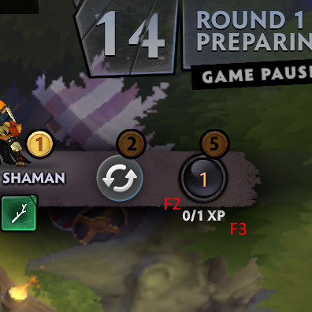

# UnderlordsLevelCostOverlay

A simple overlay application that uses OCR to calulate the amount of gold required to level in the Valve game Dota Underlords with a single click.

Please read the usage instructions before using the application.

### Requirements

- Windows
- Python 3.7 (64-bit) (may work on other versions, untested)
- The required packages (instructions below)

### Package installation

Use the following command after opening a command window in the directory with all the files. You may wish to first create a virtual environment.

```
pip install -r requirements.txt
```

After that, simply run the application.

```
python3 underlords_level_overlay.py
```

### Usage instructions

- Run the app
- Start Dota Underlords
- Drag the red square to where you want it to be positioned
- Open the shop
- Hover (DO NOT CLICK) your mouse pointer over the top left area of the x/y XP section of the shop window and press F2. The square should turn yellow.
- Do the same for the bottom right corner, and press F3. The square should turn green, meaning it is now ready to be used. (see image below for a better visualisation).
- If the square does not change colour, it means the overlay window is not focused. Simply click it once to focus it.
- To calculate the cost of levelling up, make sure the shop is open and click on the green square. The cost should appear.
- As of now, you have to click on the square to update the cost. There are plans to add automatic updating in the future.


